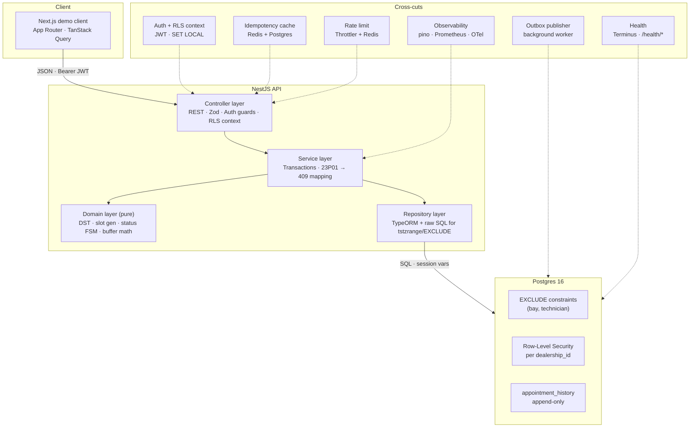
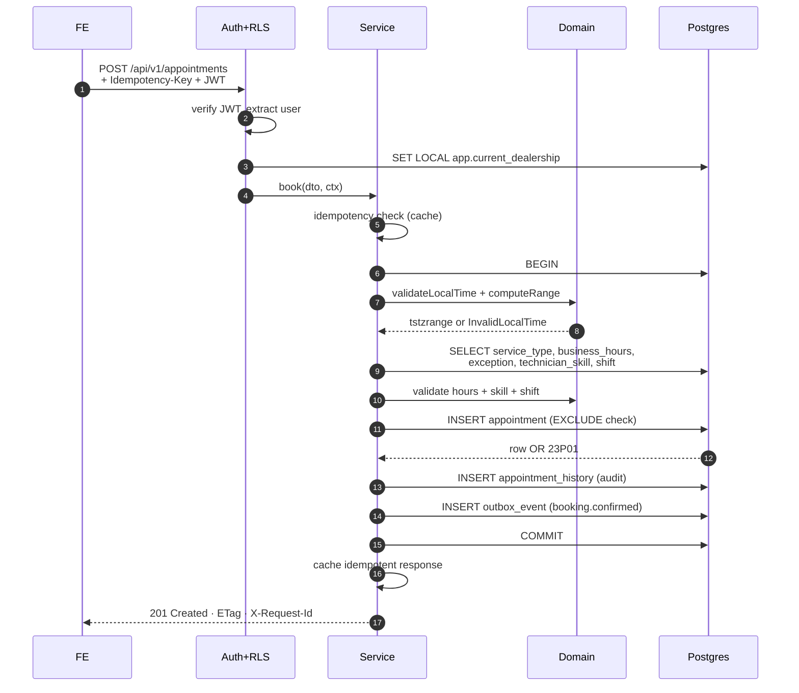
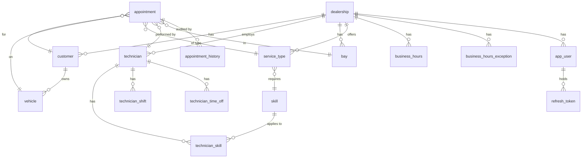

# Keyloop Scenario A — Unified Service Scheduler

**Status:** Design approved, pending implementation
**Author:** Luu (luuphuc6297@gmail.com)
**Date:** 2026-04-28
**Version:** 1.0

---

## 1. Executive Summary

Service Scheduler is a multi-tenant appointment booking system for automotive dealerships. Users book service appointments tied to a specific vehicle, service type, dealership, technician, and bay at a chosen time. The system enforces resource constraints (no double-booking of bays or technicians), respects business hours and technician schedules, and handles race conditions safely through Postgres `EXCLUDE` constraints with `tstzrange` and `btree_gist`.

Built as a NestJS + Postgres backend with a minimal Next.js demo client. The design prioritizes:

- **Race-safety by construction** via DB-level constraints, not app-level locking.
- **Tenant isolation** via Postgres Row-Level Security with per-request context.
- **Production readiness** — idempotency, optimistic locking, rate limiting, account lockout, GDPR anonymization, transactional outbox, validated SLOs via k6 load tests.
- **Observability** through structured logging (pino), Prometheus metrics, OpenTelemetry tracing with correlation ID propagation.
- **AI-assisted implementation** with explicit verification methodology documented in the README.

---

## 2. Scope & Assumptions

### 2.1 In Scope

**Core booking:**
POST /appointments with availability check + race-safe insert; GET /availability with free slot windows; GET /appointments (list with filters); GET /appointments/:id; DELETE /appointments/:id (soft-cancel); PATCH /appointments/:id (reschedule with optimistic locking); GET /appointments/:id/history (audit timeline); seed data for all catalog entities.

**Authentication & multi-tenancy:**
JWT auth (access + refresh, rotation, token-family reuse detection), Argon2id password hashing, account lockout after 5 failed logins per 15 minutes, Postgres RLS with `FORCE ROW LEVEL SECURITY` on every tenanted table, three-role architecture (`scheduler_owner` / `scheduler_migrator` / `scheduler_app`).

**Production-grade hygiene:**
Idempotency keys on POST creates (24-hour cache), optimistic locking (`ETag` / `If-Match`) on PATCH, rate limiting per endpoint, security headers (Helmet, CORS, CSP, HSTS), transactional outbox for event publishing, GDPR anonymization endpoint, ETag-based caching on read endpoints, cursor-based pagination.

**Time & schedule:**
Continuous time on backend (`tstzrange` UTC), per-dealership IANA timezone, per-dealership-per-day-of-week business hours, holiday/exception override table, technician shifts (per-DOW recurring), technician time-off (date or date-range), service buffer time, DST handling with explicit policy.

**Status & audit:**
Finite state machine for appointment status (DB trigger + service-layer enforcement), append-only `appointment_history` for status / time_range / technician changes, app-layer audit write with explicit `changed_by`.

**Observability:**
pino JSON structured logging with redaction, Prometheus metrics, OpenTelemetry tracing (console / OTLP exporter), correlation ID across logs / traces / response headers / Postgres GUCs, health endpoints (liveness + readiness), k6 load tests with SLO assertions.

**Frontend demo (intentionally minimal):**
Two main pages — `/book` (booking form), `/appointments` (list). Login + token storage + auto-refresh. TanStack Query, react-hook-form + Zod, Tailwind + shadcn/ui (minimal). Time-boxed at 6-9 hours; not the evaluated implementation layer.

### 2.2 Out of Scope (Future Work)

Notifications/reminders, pricing & parts inventory, work orders/invoicing, multi-technician services, walk-in capacity reservation, variable seasonal hours, mid-day closures (lunch breaks), recurring appointments, customer self-service portal UI, webhook consumer (outbox pattern is in place; subscriber not implemented), multi-region disaster recovery, mutation testing, visual regression testing, internationalization, detailed cloud cost analysis.

### 2.3 Domain Assumptions

- Customer can own multiple vehicles; each vehicle belongs to exactly one customer.
- Service requires exactly one technician + one bay.
- Skill requirement on `service_type.required_skill_id` is a single skill (nullable).
- Technician shifts follow a per-day-of-week recurring pattern; variability handled via `technician_time_off` overrides.
- Appointments do not span multiple days; cross-midnight services are out of scope.
- Customer's `dealership_id` is the dealership where their vehicle is registered.
- All times stored in UTC; rendering/validation use the dealership's IANA timezone.

### 2.4 Budget & Timeline

Estimated effort with full integrated scope: 145-188 hours total (115-148h backend + 6-9h FE + 20% buffer) ≈ 18-24 days full-time. This reflects senior-grade production readiness with all P0/P1 gaps integrated, not minimum-viable.

---

## 3. Architecture

### 3.1 High-Level Overview



### 3.2 Component Responsibilities

**Next.js demo client.** Two pages (Book, List), TanStack Query for server state, react-hook-form + Zod for form validation, Bearer JWT in headers. No business logic, no duplicated validation. Treated as a minimal demo harness, not the evaluated implementation layer.

**Controller layer.** REST endpoints under `/api/v1/*`. Zod schemas validate request bodies via `ZodValidationPipe`. JWT authentication guards verify tokens. The `RlsContextInterceptor` opens a transaction per request and runs `SET LOCAL app.current_dealership = $1` before any service code, so RLS policies auto-apply.

**Service layer.** Orchestrates transactions. Booking, reschedule, cancel all execute inside `dataSource.transaction()`. Catches Postgres `23P01` (exclusion violation) and translates to `ConflictException` with code/message keyed off `error.constraint`. Single point of contact between domain and DB.

**Domain layer (pure).** Function-only, no I/O. DST validation with Luxon, slot generator for availability, status finite-state-machine, buffer math, time-range computation. 100% unit-testable without DB.

**Repository layer.** TypeORM entities for standard CRUD. Raw SQL escape hatches for `EXCLUDE` constraints, range overlap queries with `&&`, RLS policy creation, GiST index hints.

**Postgres 16.** Extensions `btree_gist` and `pgcrypto`. Two partial `EXCLUDE` constraints on `appointment` (bay, technician) `WHERE status = 'confirmed'`. RLS policies on every table containing `dealership_id`. Append-only `appointment_history` audit table.

**Cross-cuts.**
*Auth + RLS:* Passport-jwt strategy, RolesGuard, per-request `SET LOCAL` for tenant context.
*Observability:* pino with correlation injection, Prometheus `/metrics`, OpenTelemetry SDK with auto-instrumentation.
*Idempotency:* Postgres-backed cache (key → request hash → response) with 24-hour TTL.
*Rate limit:* `@nestjs/throttler` with Redis store, per-endpoint tiers.
*Outbox publisher:* Cron-driven worker polling `outbox_event` for unpublished records, publishing to log/queue/webhook subscribers, marking sent.
*Health:* Terminus liveness/readiness probes with DB ping.

### 3.3 Data Flow — Booking Happy Path



Step 1-4 — auth + RLS: JWT verified, `app.current_dealership` GUC set in the transaction. All subsequent queries are auto-filtered.

Step 5-6 — DST gate: domain validates the local time before hitting heavier I/O. Spring-forward non-existent times rejected early.

Step 7-9 — pre-flight reads: catalog lookup batched. Domain validates pure-functionally.

Step 10 — INSERT is the race-detection point: Postgres `EXCLUDE` is the gatekeeper. No app-level "check then insert" pattern.

Step 11-13 — atomic side-effects: audit history and outbox event written in the same transaction. If anything fails, the entire booking rolls back.

### 3.4 Data Flow — Race Condition

Two concurrent requests R1 and R2 booking the same bay/technician/time-range:
1. Both pass authentication, RLS, validation, and reach the INSERT.
2. R1 commits first. Postgres releases the GiST row lock.
3. R2's INSERT triggers `EXCLUDE` constraint check. R1's row is now visible (READ COMMITTED). R2 fails with `23P01 exclusion_violation`, `constraint = 'appt_bay_no_overlap'`.
4. Service layer catches, parses constraint name, throws `ConflictException({code: 'BAY_UNAVAILABLE', conflictingResource: 'bay'})`.
5. FE TanStack Query mutation `onError` shows a destructive toast with the localized message.

If R1 and R2 are exactly simultaneous, Postgres' GiST row-level locking inside `EXCLUDE` blocks one until the other commits/rolls back. The blocked request then re-evaluates and fails. No application-level retry, no advisory locking required.

---

## 4. Domain Model & Database Schema

### 4.1 Entity-Relationship Overview



### 4.2 Entity Inventory (15 tables)

**Identity & tenant:** `dealership`, `app_user`, `refresh_token`, `failed_login_attempt`.

**Catalog:** `customer`, `vehicle`, `service_type`, `bay`, `skill`, `technician`, `technician_skill`.

**Schedule:** `business_hours`, `business_hours_exception`, `technician_shift`, `technician_time_off`.

**Booking:** `appointment` (with optimistic-locking `version`), `appointment_history`.

**Production hygiene:** `idempotency_record`, `outbox_event`.

### 4.3 Schema Highlights — `appointment`

The most consequential table. Key DDL features:

- `time_range tstzrange NOT NULL` — UTC, half-open `[start, end)`, exclusive of upper bound to prevent boundary-collision bugs (10:00-10:30 does not conflict with 10:30-11:00).
- Two partial `EXCLUDE USING gist` constraints — one for `bay_id`, one for `technician_id`, both `WHERE (status = 'confirmed')` so cancelled rows do not block re-booking.
- `version int NOT NULL DEFAULT 1` — optimistic locking. Trigger increments on `UPDATE` when columns change.
- `status appointment_status` ENUM (`confirmed`, `completed`, `cancelled`, `no_show`) — DB-level finite-state-machine via trigger plus service-layer enforcement.
- `created_by uuid NOT NULL REFERENCES app_user(id)` — tracks who booked (could differ from customer when service-advisor books on behalf).
- `dealership_id uuid` — RLS column. `FORCE ROW LEVEL SECURITY` enforces even for table owner.
- All FKs declared `ON DELETE RESTRICT` to protect booking integrity.

Full DDL in **Appendix A**.

### 4.4 Optimistic Locking

`PATCH /appointments/:id` requires `If-Match: "<version>"` header. Service layer issues `UPDATE ... WHERE id = $1 AND version = $expected` and returns `412 Precondition Failed` if `result.affected === 0`. Trigger increments `version` on every meaningful column change. Clients receive `ETag: "1"` (etc.) in responses and pass it back on subsequent edits.

This is in addition to (not in lieu of) the `EXCLUDE` constraint. Optimistic locking prevents *user-perceived stale-write* conflicts (read appointment → edit → save back, but someone else changed it in between). `EXCLUDE` prevents *resource* conflicts (two users booking same slot). Both are needed.

### 4.5 GDPR Anonymization

`DELETE /api/v1/customers/:id` does not actually delete. It sets:
- `customer.first_name = 'REDACTED'`
- `customer.last_name = 'REDACTED'`
- `customer.email = NULL`, `customer.phone = NULL`
- `customer.anonymized_at = now()`
- `customer.anonymization_reason = '<reason>'`

`customer.id` and `customer.dealership_id` retained so appointment FK integrity is preserved. Audit history rows reference `customer_id` and remain intact for legal/audit retention.

`GET /api/v1/customers/:id/data-export` exposes a JSON dump for GDPR data portability. Returns customer data + their appointments + their vehicles in canonical form.

### 4.6 Archival Pattern (Documented, Not Implemented)

Cron job (NestJS `@Cron('0 2 * * 0')` weekly):
```
SELECT * FROM appointment
WHERE lower(time_range) < now() - interval '5 years'
  AND status IN ('completed', 'cancelled', 'no_show');
```
Export to S3 Parquet, then `DELETE` in transaction. Hot Postgres retains 5-year window. Documented in runbook as future work; CRON stub present, S3 sink not configured.

---

## 5. API Surface

### 5.1 Endpoint Inventory

| Method | Path | Auth | Roles | Notes |
|---|---|---|---|---|
| POST | `/api/v1/auth/login` | — | — | email + password → tokens; rate-limited 5/15min |
| POST | `/api/v1/auth/refresh` | refresh JWT | — | rotate refresh; family reuse detection |
| POST | `/api/v1/auth/logout` | access JWT | any | revoke refresh family |
| GET | `/api/v1/auth/me` | access JWT | any | current user info |
| POST | `/api/v1/appointments` | access JWT | service_advisor, manager | book — `Idempotency-Key` required |
| GET | `/api/v1/appointments` | access JWT | any | list with filter + cursor pagination |
| GET | `/api/v1/appointments/:id` | access JWT | any | detail; returns ETag |
| PATCH | `/api/v1/appointments/:id` | access JWT | service_advisor, manager | reschedule/transition; `If-Match` required |
| DELETE | `/api/v1/appointments/:id` | access JWT | service_advisor, manager | soft-cancel via status |
| GET | `/api/v1/appointments/:id/history` | access JWT | any | audit timeline |
| GET | `/api/v1/availability` | access JWT | any | free slot windows |
| GET | `/api/v1/dealerships/me` | access JWT | any | own dealership context |
| GET | `/api/v1/dealerships/me/service-types` | access JWT | any | catalog; cacheable 5min |
| GET | `/api/v1/dealerships/me/technicians` | access JWT | any | catalog; cacheable 5min |
| GET | `/api/v1/dealerships/me/bays` | access JWT | any | catalog; cacheable 5min |
| GET | `/api/v1/dealerships/me/business-hours` | access JWT | any | hours + exceptions |
| GET | `/api/v1/customers?q=` | access JWT | any | search by email/name |
| DELETE | `/api/v1/customers/:id` | access JWT | manager | GDPR anonymize |
| GET | `/api/v1/customers/:id/data-export` | access JWT | manager | GDPR portability |
| GET | `/api/v1/vehicles?vin=` | access JWT | any | search by VIN |
| GET | `/health/liveness` | — | — | Terminus liveness |
| GET | `/health/readiness` | — | — | Terminus + DB ping |
| GET | `/metrics` | — | — | Prometheus scrape |
| GET | `/api/docs` | — | — | Swagger UI |

### 5.2 RFC 7807 problem+json Error Shape

Every error response uses `application/problem+json` with stable `code` enum:

```json
HTTP/1.1 409 Conflict
Content-Type: application/problem+json

{
  "type": "https://api.scheduler.local/problems/booking-conflict",
  "title": "Booking conflict",
  "status": 409,
  "code": "BAY_UNAVAILABLE",
  "detail": "The requested bay is already booked for this time slot",
  "conflictingResource": "bay",
  "instance": "/api/v1/appointments",
  "request_id": "01HQXY1234567890",
  "timestamp": "2026-04-28T10:00:00Z"
}
```

Stable error codes: `INVALID_CREDENTIALS`, `ACCOUNT_LOCKED`, `TOKEN_INVALID`, `TOKEN_REVOKED`, `BAY_UNAVAILABLE`, `TECHNICIAN_UNAVAILABLE`, `BOOKING_CONFLICT`, `INVALID_LOCAL_TIME`, `OUTSIDE_BUSINESS_HOURS`, `DEALERSHIP_CLOSED`, `TECHNICIAN_OFF_SHIFT`, `TECHNICIAN_LACKS_SKILL`, `INVALID_STATUS_TRANSITION`, `IDEMPOTENCY_KEY_REQUIRED`, `IDEMPOTENCY_KEY_CONFLICT`, `IF_MATCH_REQUIRED`, `PRECONDITION_FAILED`, `RATE_LIMIT_EXCEEDED`.

Implemented via global `ProblemDetailsExceptionFilter` mapping NestJS exceptions to the shape.

### 5.3 API Conventions

**Versioning.** URL prefix `/api/v1/...`. No header versioning.

**Casing.** kebab-case in paths, snake_case in JSON bodies, camelCase in TypeScript code. Conversion handled by `class-transformer` integration with Zod.

**Idempotency.** `Idempotency-Key: <ulid>` header mandatory on POST creates. Server caches `(key, request_hash, response)` for 24 hours in `idempotency_record`. Replay with same key + same body → returns cached response. Replay with same key + different body → `409 IDEMPOTENCY_KEY_CONFLICT`.

**Optimistic locking.** PATCH endpoints require `If-Match: "<version>"`. Server returns `ETag: "<version>"` on responses. Stale ETag → `412 PRECONDITION_FAILED`.

**Conditional GET.** Read endpoints support `If-None-Match` header. Server returns `304 Not Modified` if unchanged. ETag derived from `updated_at` for catalog tables, from `version` for appointments.

**Caching.** `Cache-Control: private, max-age=300` on catalog endpoints (`/dealerships/me/*`). `Cache-Control: no-store` on appointment endpoints (mutation-prone).

**Pagination.** Cursor-based: `?cursor=<base64>&limit=20`. Cursor encodes `(lower(time_range), id)` for stable ordering. Response: `{data: [...], next_cursor: "<base64>"|null, has_more: bool}`.

**Rate-limit headers.** Every response includes `X-RateLimit-Limit`, `X-RateLimit-Remaining`, `X-RateLimit-Reset` (Unix timestamp).

**Correlation.** Request honors incoming `X-Request-Id` header if present, else generates ULID. Echoes in response header.

**Time encoding.** All timestamps in JSON are ISO 8601 with offset (e.g., `2026-05-01T09:15:00-05:00`). Server stores UTC.

### 5.4 Booking — Implementation

**Zod schema (DTO):**

```typescript
export const BookAppointmentSchema = z.object({
  start_at:        z.string().datetime({ offset: true }),
  customer_id:     z.string().uuid(),
  vehicle_id:      z.string().uuid(),
  service_type_id: z.string().uuid(),
  technician_id:   z.string().uuid(),
  bay_id:          z.string().uuid(),
}).strict();
```

**Controller:**

```typescript
@Controller('api/v1/appointments')
@UseGuards(JwtAuthGuard, RolesGuard)
@UseInterceptors(RlsContextInterceptor, EtagInterceptor)
export class AppointmentsController {
  constructor(private readonly appointments: AppointmentsService) {}

  @Post()
  @Roles('service_advisor', 'manager')
  @Throttle({ short: { ttl: 60_000, limit: 30 } })
  async book(
    @Body(new ZodValidationPipe(BookAppointmentSchema)) dto: BookAppointmentDto,
    @CurrentUser() user: AuthContext,
    @Headers('idempotency-key') idempotencyKey?: string,
  ): Promise<AppointmentResponse> {
    if (!idempotencyKey) {
      throw new BadRequestException({ code: 'IDEMPOTENCY_KEY_REQUIRED' });
    }
    return this.appointments.bookIdempotent(dto, user, idempotencyKey);
  }
}
```

**Service (idempotency wrapper):**

```typescript
async bookIdempotent(dto, user, key): Promise<AppointmentResponse> {
  const requestHash = sha256(canonicalize(dto));
  const cached = await this.idempotency.get(key, user.id);
  if (cached) {
    if (cached.requestHash !== requestHash) {
      this.metrics.idempotencyCache.labels({ result: 'conflict' }).inc();
      throw new ConflictException({ code: 'IDEMPOTENCY_KEY_CONFLICT' });
    }
    this.metrics.idempotencyCache.labels({ result: 'hit' }).inc();
    return cached.response;
  }
  this.metrics.idempotencyCache.labels({ result: 'miss' }).inc();
  const response = await this.book(dto, user);
  await this.idempotency.put(key, requestHash, response, user.id);
  return response;
}
```

**Service (core booking):**

```typescript
async book(dto, user): Promise<AppointmentResponse> {
  return this.ds.transaction(async (manager) => {
    const serviceType = await manager.findOneOrFail(ServiceType, { where: { id: dto.service_type_id } });
    const dealership  = await manager.findOneOrFail(Dealership,  { where: { id: user.dealershipId } });

    const timeRange = computeTimeRange({
      startAt: dto.start_at,
      durationMinutes: serviceType.durationMinutes,
      bufferMinutes: serviceType.bufferMinutes,
      timezone: dealership.timezone,
    });

    await this.validators.businessHours(timeRange, dealership, manager);
    await this.validators.skillMatch(dto.technician_id, serviceType.requiredSkillId, manager);
    await this.validators.technicianShift(dto.technician_id, timeRange, dealership.timezone, manager);
    await this.validators.crossDayDstSafety(timeRange, dealership.timezone);

    const appointment = manager.create(Appointment, {
      ...dto,
      dealershipId: user.dealershipId,
      timeRange,
      status: AppointmentStatus.CONFIRMED,
      createdBy: user.id,
    });

    let saved: Appointment;
    try {
      saved = await manager.save(appointment);
    } catch (e) {
      throw this.translateDbError(e);
    }

    await manager.save(AppointmentHistory, {
      appointmentId: saved.id,
      dealershipId: saved.dealershipId,
      field: 'created',
      newValue: instanceToPlain(saved),
      changedBy: user.id,
    });

    await manager.save(OutboxEvent, {
      dealershipId: saved.dealershipId,
      aggregateType: 'appointment',
      aggregateId: saved.id,
      eventType: 'appointment.confirmed',
      payload: AppointmentEvent.from(saved),
    });

    this.metrics.appointmentsCreated.labels({
      dealership_id: saved.dealershipId,
      service_type_id: saved.serviceTypeId,
    }).inc();

    return AppointmentResponse.from(saved);
  });
}

private translateDbError(e: unknown): Error {
  if (!(e instanceof QueryFailedError)) return e as Error;
  const driverError = e.driverError as { code?: string; constraint?: string };
  if (driverError.code !== '23P01') return e;

  switch (driverError.constraint) {
    case 'appt_bay_no_overlap':
      this.metrics.bookingsConflict.labels({ resource: 'bay' }).inc();
      return new ConflictException({
        code: 'BAY_UNAVAILABLE',
        message: 'The requested bay is already booked for this time slot',
        conflictingResource: 'bay',
      });
    case 'appt_technician_no_overlap':
      this.metrics.bookingsConflict.labels({ resource: 'technician' }).inc();
      return new ConflictException({
        code: 'TECHNICIAN_UNAVAILABLE',
        message: 'The technician is not available for this time slot',
        conflictingResource: 'technician',
      });
    default:
      return new ConflictException({ code: 'BOOKING_CONFLICT' });
  }
}
```

**Reschedule with optimistic locking:**

```typescript
async reschedule(id, dto, user, expectedVersion): Promise<AppointmentResponse> {
  return this.ds.transaction(async (manager) => {
    const result = await manager
      .createQueryBuilder()
      .update(Appointment)
      .set({ timeRange: dto.computedRange, technicianId: dto.technician_id, bayId: dto.bay_id })
      .where('id = :id AND version = :version', { id, version: expectedVersion })
      .returning('*')
      .execute();

    if (result.affected === 0) {
      const exists = await manager.findOne(Appointment, { where: { id } });
      if (!exists) throw new NotFoundException({ code: 'APPOINTMENT_NOT_FOUND' });
      throw new PreconditionFailedException({
        code: 'PRECONDITION_FAILED',
        message: 'Appointment was modified; refresh and retry',
        currentVersion: exists.version,
      });
    }

    const updated = result.raw[0];
    await this.recordHistory(manager, updated, user, 'time_range');
    await this.publishOutbox(manager, updated, 'appointment.rescheduled');
    return AppointmentResponse.from(updated);
  });
}
```

### 5.5 Availability — Algorithm Sketch

`GET /availability?service_type_id=&technician_id=&from=&to=` returns free 30-minute candidate slots, each pre-quantized for FE rendering.

Algorithm (raw SQL with CTEs for performance):

```sql
WITH params AS (SELECT $1::uuid AS svc, $2::uuid AS tech, $3::date AS from_date, $4::date AS to_date),
     dealership_tz AS (SELECT timezone FROM dealership LIMIT 1),
     business AS (
       SELECT bh.day_of_week, bh.open_time, bh.close_time
       FROM business_hours bh
       WHERE bh.dealership_id = current_setting('app.current_dealership')::uuid
     ),
     exceptions AS (
       SELECT date, is_closed, override_open, override_close
       FROM business_hours_exception
       WHERE dealership_id = current_setting('app.current_dealership')::uuid
         AND date BETWEEN (SELECT from_date FROM params) AND (SELECT to_date FROM params)
     ),
     tech_shift AS (...),
     time_off AS (...),
     booked AS (
       SELECT time_range FROM appointment
       WHERE technician_id = (SELECT tech FROM params)
         AND status = 'confirmed'
         AND time_range && tstzrange(...)
     ),
     -- intersect business hours with technician shift, subtract time_off and booked,
     -- compute candidate 30-min windows that fully contain (duration + buffer)
     ...
SELECT slot_start, slot_end, technician_id, bay_id FROM candidate_slots;
```

Full SQL in **Appendix B**. Quantization to 30-minute intervals is a *frontend convention*; backend accepts any minute alignment. Documented so a future native mobile client can pick continuous times.

---

## 6. Concurrency Strategy

### 6.1 Chosen Approach — `EXCLUDE` Constraint with `tstzrange`

```sql
CONSTRAINT appt_bay_no_overlap
  EXCLUDE USING gist (bay_id WITH =, time_range WITH &&)
  WHERE (status = 'confirmed'),

CONSTRAINT appt_technician_no_overlap
  EXCLUDE USING gist (technician_id WITH =, time_range WITH &&)
  WHERE (status = 'confirmed')
```

The Postgres GiST-backed `EXCLUDE` constraint is the *only* race-safety gate. The application contains no "check then insert" pattern. Insertion either succeeds atomically or fails with `23P01 exclusion_violation`.

### 6.2 Alternatives Considered

**SERIALIZABLE transaction with retry on `40001 serialization_failure`.** Classic, easy to explain, works with arbitrary read-modify-write logic. *Rejected because* throughput drops sharply under contention, retry logic adds complexity, abort messages require translation, and our invariant (no overlap on shared resource) is precisely expressible declaratively.

**Advisory locks per resource (`pg_advisory_xact_lock(hash(bay_id))`).** Precise scope, fast, no retry. *Rejected because* "advisory" means voluntary — code can bypass; lock-ordering discipline is required to avoid deadlocks; imperative versus the declarative `EXCLUDE` philosophy.

### 6.3 Why `EXCLUDE` Is the Right Pick

1. **Declarative correctness.** The DB schema documents the business rule. Future contributors cannot accidentally break race-safety without altering the schema.
2. **No retry storm.** `EXCLUDE` failures are deterministic per request — no retry loops, no jitter, no thundering herd.
3. **Observability win.** `bookings_conflict_total{resource="bay"}` directly counts EXCLUDE hits. Dashboard shows real demand contention.
4. **Test simplicity.** Race tests are trivial: spawn N concurrent inserts, assert exactly 1 succeeds. No parallel orchestration of locks or retries.
5. **Postgres expertise signal.** GiST + `tstzrange` + partial constraint is an idiomatic Postgres pattern that few candidates reach for. Reflects deep familiarity with the engine.

### 6.4 Edge Cases & How They're Handled

**Cancelled appointments must not block re-booking.** `WHERE (status = 'confirmed')` partial constraint excludes cancelled rows. Verified by test `cancelled appointment frees its slot`.

**Reschedule via UPDATE inside transaction.** Not DELETE + INSERT. `UPDATE` re-evaluates `EXCLUDE` against the new range. Pessimistic lock (`SELECT ... FOR UPDATE`) on the appointment row inside the transaction prevents two reschedules of the same appointment from racing.

**Multi-resource appointment (engine swap with 2 technicians).** Out of scope. Future model would use a junction `appointment_technician` and a per-technician overlap check via subquery; `EXCLUDE` alone cannot express it.

**Cross-day appointments and DST transitions.** `time_range` is half-open `[start, end)`. DST validation in the domain layer rejects ranges that contain a non-existent local time (spring-forward). Cross-midnight services are explicitly out of scope.

**Half-open range semantics.** `[09:00, 09:30)` does *not* conflict with `[09:30, 10:00)` because Postgres `&&` operator on `tstzrange` respects bound inclusivity. Documented to prevent off-by-one.

---

## 7. Authentication & Authorization

### 7.1 Token Model

**Access token (JWT, 15-minute TTL).** Stateless, signed HS256 (rotated to RS256 in production). Payload:
```json
{ "sub": "<user_uuid>", "dealership_id": "<uuid>", "roles": ["service_advisor"], "iat": ..., "exp": ..., "jti": "<uuid>" }
```

**Refresh token (opaque, 7-day TTL).** 256-bit random, base64url-encoded. SHA-256 hash stored in `refresh_token` table with `family_id`. Rotation on every refresh. Reuse detection: if a token is presented twice (the second after rotation), the entire family is revoked — mitigates token theft.

**Argon2id for password hashing.** OWASP 2025 recommendation; memory-hard, resistant to GPU attacks. Parameters: `m=64MB, t=3, p=4`.

### 7.2 Login Flow with Account Lockout

```typescript
async login(dto, meta) {
  const user = await this.users.findByEmail(dto.email);

  if (user?.lockedUntil && user.lockedUntil > new Date()) {
    throw new HttpException({
      code: 'ACCOUNT_LOCKED',
      lockedUntil: user.lockedUntil,
    }, HttpStatus.LOCKED);
  }

  if (!user || !await argon2.verify(user.passwordHash, dto.password)) {
    await this.recordFailedLogin(dto.email, meta);
    if (user) {
      const recent = await this.failedLogins.countRecent(dto.email, '15 minutes');
      if (recent >= 5) {
        await this.users.lock(user.id, addMinutes(new Date(), 30));
        this.metrics.accountsLocked.inc();
      }
    }
    throw new UnauthorizedException({ code: 'INVALID_CREDENTIALS' });
  }

  await this.users.resetFailedLogins(user.id);
  return this.issueTokenPair(user, meta);
}
```

Lockout window: 30 minutes after 5 failed attempts within 15 minutes. Tracked in `failed_login_attempt` table (no FK to `app_user` so non-existent emails also count — defense against email enumeration timing attacks).

### 7.3 Refresh with Rotation + Reuse Detection

```typescript
async refresh(rawToken, meta) {
  const tokenHash = sha256(rawToken);
  const stored = await this.refreshTokens.findByHash(tokenHash);

  if (stored?.revokedAt) {
    await this.refreshTokens.revokeFamily(stored.familyId);
    this.metrics.refreshTokenReuse.inc();
    this.logger.warn({ userId: stored.userId, familyId: stored.familyId }, 'refresh.token.reuse');
    throw new UnauthorizedException({ code: 'TOKEN_REVOKED' });
  }

  if (!stored || stored.expiresAt < new Date()) {
    throw new UnauthorizedException({ code: 'TOKEN_INVALID' });
  }

  await this.refreshTokens.revoke(stored.id);
  return this.issueTokenPair(await this.users.findById(stored.userId), meta);
}
```

### 7.4 Postgres Role Architecture

```sql
-- Owner: schema management, BYPASSRLS, used by migrations
CREATE ROLE scheduler_owner LOGIN PASSWORD '...' BYPASSRLS;

-- App runtime: NestJS process, no BYPASSRLS, RLS-enforced
CREATE ROLE scheduler_app LOGIN PASSWORD '...';
GRANT USAGE ON SCHEMA public TO scheduler_app;
GRANT SELECT, INSERT, UPDATE, DELETE ON ALL TABLES IN SCHEMA public TO scheduler_app;
GRANT USAGE ON ALL SEQUENCES IN SCHEMA public TO scheduler_app;

-- Migration: CI/CD, BYPASSRLS, inherits from owner
CREATE ROLE scheduler_migrator LOGIN PASSWORD '...' BYPASSRLS;
GRANT scheduler_owner TO scheduler_migrator;
```

App-runtime connection uses `scheduler_app` exclusively. RLS policies cannot be bypassed from application code, regardless of intent.

### 7.5 RLS Policies

```sql
ALTER TABLE appointment ENABLE ROW LEVEL SECURITY;
ALTER TABLE appointment FORCE ROW LEVEL SECURITY;

CREATE POLICY appt_tenant_isolation ON appointment
  USING       (dealership_id::text = current_setting('app.current_dealership', true))
  WITH CHECK  (dealership_id::text = current_setting('app.current_dealership', true));
```

`FORCE ROW LEVEL SECURITY` ensures the policy applies even when queried by table owner. `current_setting('app.current_dealership', true)` — second argument `true` returns NULL when unset, fail-safe (NULL filter excludes everything).

`app_user` and `failed_login_attempt` do not enable RLS — login must look up across tenants.

### 7.6 Per-Request RLS Context

Implementation via `typeorm-transactional` + AsyncLocalStorage:

```typescript
// rls-context.interceptor.ts
async intercept(ctx: ExecutionContext, next: CallHandler) {
  const req = ctx.switchToHttp().getRequest();
  const user = req.user as AuthContext | undefined;
  if (!user) return next.handle();

  return new Observable((subscriber) => {
    runInTransaction(async () => {
      const manager = getEntityManager();
      await manager.query('SET LOCAL app.current_dealership = $1', [user.dealershipId]);
      await manager.query('SET LOCAL app.current_user_id = $1',     [user.id]);
      await manager.query('SET LOCAL app.current_request_id = $1',  [req.id]);
      return firstValueFrom(next.handle());
    })
      .then((v) => { subscriber.next(v); subscriber.complete(); })
      .catch((e) => subscriber.error(e));
  });
}
```

`SET LOCAL` is bound to the transaction. Commit/rollback releases the GUC, so connection-pool reuse cannot leak context between requests. All authenticated endpoints — even pure reads — execute inside a transaction.

### 7.7 Rate Limiting

```typescript
ThrottlerModule.forRootAsync({
  useFactory: () => ({
    storage: new ThrottlerStorageRedisService(redisClient),
    throttlers: [
      { name: 'short',  ttl: 1_000,    limit: 20 },
      { name: 'medium', ttl: 60_000,   limit: 100 },
    ],
  }),
}),
```

Per-endpoint overrides:
- `POST /auth/login`: 5 / 15 minutes / IP
- `POST /auth/refresh`: 10 / 5 minutes / user
- `POST /appointments`: 30 / minute / user
- Default: 100 / minute / user

Returns `429 RATE_LIMIT_EXCEEDED` with `Retry-After` header.

### 7.8 Security Headers (Helmet) & CORS

```typescript
app.use(helmet({
  contentSecurityPolicy: { directives: { defaultSrc: ["'self'"], scriptSrc: ["'self'"], styleSrc: ["'self'", "'unsafe-inline'"], imgSrc: ["'self'", 'data:'] } },
  hsts: { maxAge: 31_536_000, includeSubDomains: true, preload: true },
  noSniff: true,
  frameguard: { action: 'deny' },
  referrerPolicy: { policy: 'strict-origin-when-cross-origin' },
}));

app.enableCors({
  origin: config.get('CORS_ALLOWED_ORIGINS').split(','),
  credentials: true,
  methods: ['GET', 'POST', 'PATCH', 'DELETE', 'OPTIONS'],
  allowedHeaders: ['Content-Type', 'Authorization', 'Idempotency-Key', 'If-Match', 'X-Request-Id'],
  exposedHeaders: ['ETag', 'X-Request-Id', 'X-RateLimit-Remaining', 'X-RateLimit-Reset'],
  maxAge: 86_400,
});
```

### 7.9 PgBouncer Note (Production Deployment)

Production should put PgBouncer between the app and Postgres for connection pooling. Critically, **PgBouncer must run in `session` pool mode**, not `transaction` mode. Reason: `SET LOCAL` is scoped to a transaction, but `transaction` mode of PgBouncer can recycle the underlying connection across transactions of the same logical request, dropping the GUC. Documented in the runbook.

---

## 8. Time, Timezone, and DST

### 8.1 Time Representation

- All timestamps stored as `tstzrange` UTC. Half-open `[start, end)`.
- Customer input: ISO 8601 with explicit timezone offset (e.g., `2026-05-01T09:15:00-05:00`).
- Duration computed server-side from `service_type.duration_minutes + service_type.buffer_minutes`.
- `dealership.timezone` (IANA, e.g., `America/New_York`) drives validation and FE rendering.

### 8.2 DST Handling Policy

Implemented with Luxon. Explicit policy documented in code and README:

- **Non-existent local time (spring-forward gap):** rejected with `400 INVALID_LOCAL_TIME`. Example: `2026-03-08T02:30:00` in `America/New_York` does not exist — clocks jump from 02:00 to 03:00.
- **Ambiguous local time (fall-back overlap):** resolved to the *earlier* offset (Luxon default). Response includes `X-DST-Resolution: earlier` header.
- **Cross-day appointment whose range crosses DST:** rejected if any intermediate local time is non-existent. Implemented via hour-walk validation in domain layer.

```typescript
export function computeTimeRange(params): string {
  const start = DateTime.fromISO(params.startAt, { setZone: true }).setZone(params.timezone);
  if (!start.isValid) throw new InvalidLocalTimeError(start.invalidExplanation ?? 'unknown');

  const roundTrip = start.toUTC().setZone(params.timezone);
  if (roundTrip.toMillis() !== start.toMillis()) {
    throw new InvalidLocalTimeError(`Local time ${params.startAt} does not exist in ${params.timezone}`);
  }

  const end = start.plus({ minutes: params.durationMinutes + params.bufferMinutes });
  return `[${start.toUTC().toISO()},${end.toUTC().toISO()})`;
}
```

### 8.3 Cross-Day & Cross-DST Validation

```typescript
export function validateRangeDoesNotCrossUnsafeDstTransition(range, tz): void {
  const startOffset = range.start.setZone(tz).offset;
  const endOffset = range.end.setZone(tz).offset;
  if (startOffset !== endOffset) {
    // Walk the range; verify each hour maps to a real local time
    let cursor = range.start;
    while (cursor < range.end) {
      const localTimeStr = cursor.setZone(tz).toISO();
      const back = DateTime.fromISO(localTimeStr, { zone: tz });
      if (back.toMillis() !== cursor.toMillis()) {
        throw new InvalidLocalTimeError('Range crosses a DST transition with skipped local time');
      }
      cursor = cursor.plus({ minutes: 30 });
    }
  }
}
```

---

## 9. Reliability & Production Readiness

### 9.1 Idempotency

Every POST that creates a resource requires `Idempotency-Key: <ulid>` header. Server caches `(key, request_hash, response, expires_at)` in `idempotency_record` for 24 hours. Hourly cron prunes expired keys.

Replay scenarios:
- Same key + same body hash → return cached response.
- Same key + different body hash → `409 IDEMPOTENCY_KEY_CONFLICT`.
- Key expired (>24h) → treated as new request.

Implementation in service layer wraps the actual `book()` to provide deduplication transparently.

### 9.2 Optimistic Locking

`appointment.version` column with trigger-incremented on meaningful UPDATEs. PATCH endpoints require `If-Match` header. UPDATE WHERE clause includes `version = $expected`; `result.affected === 0` triggers `412 PRECONDITION_FAILED`. Response includes `currentVersion` so client can refresh and retry intelligently.

### 9.3 Transactional Outbox

```sql
CREATE TABLE outbox_event (
  id uuid PRIMARY KEY DEFAULT gen_random_uuid(),
  dealership_id uuid NOT NULL,
  aggregate_type text NOT NULL,
  aggregate_id uuid NOT NULL,
  event_type text NOT NULL,
  payload jsonb NOT NULL,
  occurred_at timestamptz NOT NULL DEFAULT now(),
  published_at timestamptz NULL,
  attempt_count int NOT NULL DEFAULT 0,
  last_error text NULL
);
CREATE INDEX idx_outbox_unpublished ON outbox_event (occurred_at) WHERE published_at IS NULL;
```

Events written in the same transaction as the aggregate change. Background worker (NestJS `@Cron` every 5 seconds) polls unpublished events, publishes (logs, queue, webhook subscriber), marks `published_at`. Failed publications retry with exponential backoff up to 5 attempts, then move to dead-letter (manual review).

This decouples event delivery from request latency and guarantees at-least-once delivery aligned with the source-of-truth commit. Webhook *consumer* implementation is out of scope; the outbox + worker pattern is in place to demonstrate.

### 9.4 Backup & Restore

- `pg_dump` nightly via cron, output to S3 bucket with versioning, 30-day retention.
- Weekly restore validation: spin up empty Postgres, restore latest backup, run `SELECT count(*) FROM appointment` → assert > 0.
- WAL archiving for point-in-time recovery (PITR) in production deployment (out of scope for demo Docker Compose).

### 9.5 Migration Strategy (Zero-Downtime)

For schema changes:
1. **Additive migration first.** Add new columns/tables with `NULL` allowed and defaults. Deploy.
2. **Backfill.** Application or migration script populates new columns. Deploy if app needs change.
3. **Switch over.** Make column `NOT NULL` if needed. Deploy.
4. **Drop deprecated.** Remove old columns/tables one release cycle later.

All migrations idempotent (`IF NOT EXISTS` / `DROP IF EXISTS`). Each migration has a corresponding rollback file. CI runs migrations against fresh Postgres to catch ordering issues.

### 9.6 Disaster Recovery

Out of scope for this implementation. Documented in **Future Work** as targets:
- RPO: 1 hour (WAL archive frequency)
- RTO: 30 minutes (warm standby in different AZ)

---

## 10. Observability

### 10.1 Logging — pino + JSON

Structured JSON to stdout. Configuration:

```typescript
LoggerModule.forRoot({
  pinoHttp: {
    level: process.env.LOG_LEVEL ?? 'info',
    redact: {
      paths: ['req.headers.authorization', 'req.headers.cookie', 'req.body.password',
              'req.body.refresh_token', '*.password_hash', '*.token_hash'],
      censor: '[REDACTED]',
    },
    customProps: (req) => ({
      request_id: req.id,
      user_id: req.user?.id,
      dealership_id: req.user?.dealershipId,
    }),
    serializers: {
      req: (req) => ({ method: req.method, url: req.url, request_id: req.id }),
      res: (res) => ({ status_code: res.statusCode }),
    },
    transport: process.env.NODE_ENV === 'development' ? { target: 'pino-pretty' } : undefined,
  },
}),
```

`@opentelemetry/instrumentation-pino` injects `trace_id` and `span_id` automatically into every log line.

Levels: `debug` (dev only), `info` (business events + request lifecycle), `warn` (recoverable issues, slow queries, refresh-token reuse), `error` (unhandled exceptions, 5xx responses).

### 10.2 Metrics — Prometheus

Endpoint `/metrics`. Selected counters and histograms:

| Metric | Type | Labels |
|---|---|---|
| `http_requests_total` | counter | method, route, status_code |
| `http_request_duration_seconds` | histogram | method, route |
| `appointments_created_total` | counter | dealership_id, service_type_id |
| `appointments_status_transition_total` | counter | from, to |
| `bookings_conflict_total` | counter | resource={bay, technician} |
| `booking_duration_seconds` | histogram | result={success, conflict, error} |
| `availability_query_duration_seconds` | histogram | dealership_id |
| `auth_login_attempts_total` | counter | result={success, failed} |
| `auth_refresh_token_reuse_total` | counter | — |
| `accounts_locked_total` | counter | — |
| `idempotency_cache_total` | counter | result={hit, miss, conflict} |
| `rate_limit_exceeded_total` | counter | endpoint, throttler |
| `optimistic_lock_failures_total` | counter | endpoint |
| `outbox_events_total` | counter | event_type, status={pending, published, failed} |
| `outbox_lag_seconds` | gauge | — |
| `gdpr_anonymization_total` | counter | — |
| `dst_validation_failures_total` | counter | timezone |
| `db_pool_size` | gauge | — |
| `db_pool_active` | gauge | — |
| `db_query_duration_seconds` | histogram | operation |

Histogram buckets:
- `http_request_duration_seconds`: `[0.005, 0.01, 0.025, 0.05, 0.1, 0.25, 0.5, 1, 2.5, 5, 10]`
- `booking_duration_seconds`: `[0.05, 0.1, 0.25, 0.5, 1, 2, 5]`
- `availability_query_duration_seconds`: `[0.01, 0.05, 0.1, 0.25, 0.5, 1, 2]`

### 10.3 Tracing — OpenTelemetry

`@opentelemetry/sdk-node` with auto-instrumentation for HTTP, Express, PG (TypeORM transparently). Custom spans for business operations:

- `appointments.book` (root within request)
  - `domain.dst_validate`
  - `domain.compute_range`
  - `validators.business_hours`
  - `validators.skill_match`
  - `validators.technician_shift`
  - `repository.insert` (auto via PG instrumentation)
  - `audit.append`
  - `outbox.append`
- `availability.compute`
- `auth.login`, `auth.refresh`

Span attributes: `dealership.id`, `user.id`, `appointment.id`, `service_type.id`.

Exporter strategy:
- Dev (no infra): `ConsoleSpanExporter` — spans print to stdout.
- Local with Jaeger UI: `docker compose --profile observability up` → OTLP exporter to collector → Jaeger at `:16686`.
- Production: OTLP collector forwards to chosen vendor (Tempo / Datadog / Honeycomb).

W3C `traceparent` header propagated end-to-end.

### 10.4 Correlation ID Flow

Middleware generates ULID per request (or honors incoming `X-Request-Id`). Stored in:
- AsyncLocalStorage (auto-injected into pino log context)
- OpenTelemetry span attribute
- Postgres GUC `app.current_request_id` (visible in `pg_stat_activity` and slow query logs via `log_line_prefix`)
- Response header `X-Request-Id` (echoed to client; carries to support tickets)

Single ID joins log + trace + DB session. Customer-reported issue → `X-Request-Id` from response → grep logs → jump to trace → inspect SQL session → root cause in 1-2 minutes.

### 10.5 Health Endpoints

```typescript
@Controller('health')
export class HealthController {
  @Get('liveness') @HealthCheck()
  liveness() { return this.health.check([]); }

  @Get('readiness') @HealthCheck()
  readiness() {
    return this.health.check([
      () => this.db.pingCheck('postgres', { timeout: 1000 }),
    ]);
  }
}
```

Liveness: process is alive (Kubernetes restart on failure). Readiness: DB reachable (Kubernetes removes from load balancer when DB down).

### 10.6 SLOs & Load Test Validation

**SLOs:**
- Booking success rate (excluding expected conflicts): >99% over 28-day window.
- Booking p95 latency: <500ms.
- Availability query p95: <200ms.
- Burn-rate alert: error budget consumed >10% in 1 hour.

**k6 load test scripts** in `load-tests/`:

```javascript
// load-tests/booking.js
import http from 'k6/http';
import { check } from 'k6';
import { ulid } from 'k6/x/ulid';

export const options = {
  scenarios: {
    sustained: {
      executor: 'constant-arrival-rate',
      rate: 50, timeUnit: '1s', duration: '5m',
      preAllocatedVUs: 30, maxVUs: 60,
    },
  },
  thresholds: {
    http_req_duration: ['p(95)<500', 'p(99)<1000'],
    http_req_failed: ['rate<0.01'],
  },
};

export default function () {
  const res = http.post(`${__ENV.API_BASE}/api/v1/appointments`,
    JSON.stringify(generatePayload()), {
    headers: {
      'Content-Type': 'application/json',
      'Authorization': `Bearer ${__ENV.JWT}`,
      'Idempotency-Key': ulid(),
    },
  });
  check(res, { 'status 201 or 409': (r) => [201, 409].includes(r.status) });
}
```

Three scripts: `booking.js`, `availability.js`, `race.js`. CI workflow `.github/workflows/load-test.yml` triggers on `workflow_dispatch` or nightly schedule. Results posted as PR comments when run on-demand.

### 10.7 Local Observability — Docker Compose

```yaml
services:
  postgres:
    image: postgres:16-alpine
    environment: { POSTGRES_PASSWORD: postgres, POSTGRES_DB: scheduler }
    ports: ['5432:5432']
    volumes: ['./db/init:/docker-entrypoint-initdb.d']

  redis:
    image: redis:7-alpine
    ports: ['6379:6379']

  otel-collector:
    image: otel/opentelemetry-collector-contrib:0.95.0
    profiles: ['observability']
    command: ['--config=/etc/otelcol/config.yaml']
    volumes: ['./otel-collector.yaml:/etc/otelcol/config.yaml:ro']
    ports: ['4318:4318']

  jaeger:
    image: jaegertracing/all-in-one:1.55
    profiles: ['observability']
    ports: ['16686:16686']

  prometheus:
    image: prom/prometheus:v2.51.0
    profiles: ['observability']
    volumes: ['./prometheus.yml:/etc/prometheus/prometheus.yml:ro']
    ports: ['9090:9090']
```

Default `docker compose up` starts only Postgres + Redis (fast iteration). Observability infrastructure is opt-in via `--profile observability`.

---

## 11. Testing Strategy

### 11.1 Test Pyramid

```
           ▲ ~5 tests · ~30s   Race condition (special)
          ▲▲ ~25 tests · ~60s  E2E (Supertest + real DB)
         ▲▲▲ ~40 tests · ~30s  Integration (Testcontainers)
        ▲▲▲▲ ~120 tests · <5s  Unit (Jest, no I/O)
```

Coverage targets: domain layer 100% line + branch, service layer ≥90%, overall ≥85% line / ≥80% branch.

### 11.2 Unit Tests

Pure functions, no I/O: DST validation, time-range computation, slot generator, status FSM, buffer math, Zod schema parsing, auth utilities. Run on save in watch mode, total <5s.

### 11.3 Integration Tests

Real Postgres via Testcontainers. Two `DataSource` connections — owner (BYPASSRLS) for fixture seeding, app (RLS-enforced) for actual scenarios.

Targets:
- `EXCLUDE` constraint behavior (overlap rejected, partial constraint scope, cancelled doesn't block).
- RLS policy enforcement (cross-tenant queries return empty, WITH CHECK rejects misaligned writes).
- Status FSM trigger (invalid transitions rejected).
- Audit history insertion with explicit `changed_by`.
- Business hours validation with exception override.
- Complex availability SQL with CTEs.
- Outbox event committed in same transaction as aggregate change.

### 11.4 E2E Tests

Supertest hitting real HTTP through full NestJS stack + Testcontainers Postgres. Targets:
- Auth flow (login → access → /me → refresh → logout).
- Full booking happy path through HTTP.
- problem+json error shape verification.
- JWT expiration handling.
- Role guards (service_advisor blocked from manager-only actions).
- Tenant isolation through HTTP layer.

### 11.5 Race Condition Tests (the money shot)

```typescript
it('concurrent identical bookings: exactly 1 succeeds', async () => {
  const dto = identicalBookingDto();
  const N = 10;
  const start = performance.now();

  const results = await Promise.allSettled(
    Array.from({ length: N }, () =>
      runAsUser(scene.user, () => service.book(dto, scene.user))),
  );

  const fulfilled = results.filter(r => r.status === 'fulfilled');
  const rejected  = results.filter(r => r.status === 'rejected') as PromiseRejectedResult[];

  expect(fulfilled).toHaveLength(1);
  expect(rejected).toHaveLength(N - 1);
  rejected.forEach(r => {
    expect(r.reason).toBeInstanceOf(ConflictException);
    const body = r.reason.getResponse();
    expect(body.code).toMatch(/^(BAY|TECHNICIAN)_UNAVAILABLE$/);
  });

  const count = await db.ownerDs.getRepository(Appointment).count();
  expect(count).toBe(1);

  const auditCount = await db.ownerDs.getRepository(AppointmentHistory).count();
  expect(auditCount).toBe(1);

  expect(performance.now() - start).toBeLessThan(2000);
});
```

Other race tests:
- `cancelled appointment frees its slot (partial EXCLUDE)`.
- `two concurrent reschedules of same appointment: pessimistic lock serializes`.
- `idempotent retry returns cached response under concurrent retries`.

### 11.6 Production-Hygiene Tests

- **Idempotency:** same key + same body → cached; same key + different body → 409.
- **Optimistic locking:** stale ETag → 412; current ETag → success + version increment.
- **Rate limiting:** 6th login in 15 min → 429; 31st booking in 1 min → 429.
- **Account lockout:** 5 failed logins → locked 30 min; successful login resets counter.
- **Security headers:** Helmet headers present on every response.
- **GDPR anonymization:** `first_name = 'REDACTED'`, `email = NULL`, appointment FK refs intact.
- **Outbox:** event written in same tx; rolled back on failure; worker publishes in order.

### 11.7 RLS Isolation Tests

```typescript
it('user of dealership A cannot read B\'s appointment by ID', async () => {
  const apptB = await db.ownerDs.getRepository(Appointment).findOneByOrFail({ dealershipId: dB.id });
  await expect(
    runAsUser(dA.user, () => service.findById(apptB.id))
  ).rejects.toThrow(NotFoundException);
});
```

### 11.8 k6 Load Tests (Validate SLOs)

Three scripts assert SLO thresholds. Run on-demand or nightly. Failure of threshold = CI red.

### 11.9 Test Infrastructure

```typescript
// test/helpers/testcontainers.ts
export class TestDb {
  container!: StartedPostgreSqlContainer;
  ownerDs!: DataSource;
  appDs!: DataSource;

  async start() {
    this.container = await new PostgreSqlContainer('postgres:16-alpine')
      .withDatabase('scheduler_test')
      .withUsername('owner')
      .withPassword('owner')
      .start();

    this.ownerDs = await this.connectAs('owner', 'owner');
    await this.ownerDs.runMigrations();

    await this.ownerDs.query(`CREATE ROLE scheduler_app LOGIN PASSWORD 'app'`);
    await this.ownerDs.query(`GRANT USAGE ON SCHEMA public TO scheduler_app`);
    await this.ownerDs.query(`GRANT SELECT, INSERT, UPDATE, DELETE ON ALL TABLES IN SCHEMA public TO scheduler_app`);
    await this.ownerDs.query(`GRANT USAGE ON ALL SEQUENCES IN SCHEMA public TO scheduler_app`);

    this.appDs = await this.connectAs('scheduler_app', 'app');
  }

  async truncateAll() { /* TRUNCATE ... RESTART IDENTITY CASCADE */ }
}
```

Cleanup between tests via `TRUNCATE` (transactional rollback complicated by production code's own tx wrapping).

### 11.10 Test Commands

```json
{
  "scripts": {
    "test": "jest",
    "test:unit": "jest --config jest.unit.config.ts",
    "test:int": "jest --config jest.int.config.ts --runInBand",
    "test:e2e": "jest --config jest.e2e.config.ts --runInBand",
    "test:watch": "jest --watch",
    "test:cov": "jest --coverage",
    "load-test:booking": "k6 run load-tests/booking.js"
  }
}
```

`--runInBand` for integration / e2e because Testcontainers leaks if parallel.

---

## 12. Frontend Demo Client

### 12.1 Stack & Scope

Next.js 15 App Router · TanStack Query v5 · react-hook-form + Zod · Tailwind + shadcn/ui (minimal: Button, Input, Toast, Card, Form). Time-boxed at 6-9 hours. Treated as a demo harness, not the evaluated implementation layer.

### 12.2 Pages

| Path | Purpose |
|---|---|
| `/login` | Email + password form. POST /auth/login → store tokens. Redirect to /book. |
| `/book` | Booking form. Pre-loads catalog. Submit → POST /appointments. |
| `/appointments` | List view. GET /appointments with filters. Click row → modal detail + history. |
| `/` | Redirect: authed → /book, unauthed → /login. |

Header: dealership name, current user email, logout button.

### 12.3 Auth Flow

In-memory access token (Zustand store), refresh token in localStorage with documented XSS trade-off (production should issue httpOnly cookie). Fetch wrapper auto-refreshes on 401:

```typescript
async function api<T>(path: string, init?: RequestInit): Promise<T> {
  const { accessToken, refreshToken, setTokens, clear } = authStore.getState();
  const headers = { ...init?.headers, Authorization: `Bearer ${accessToken}` };

  let res = await fetch(`${API_BASE}${path}`, { ...init, headers });

  if (res.status === 401 && refreshToken) {
    const refreshed = await refreshAccessToken(refreshToken);
    if (refreshed) {
      setTokens(refreshed.accessToken, refreshed.refreshToken);
      res = await fetch(`${API_BASE}${path}`, {
        ...init,
        headers: { ...init?.headers, Authorization: `Bearer ${refreshed.accessToken}` },
      });
    } else {
      clear();
      window.location.href = '/login';
      throw new Error('Session expired');
    }
  }

  if (!res.ok) {
    const problem = await res.json();
    throw new ApiError(problem);
  }
  return res.json();
}
```

### 12.4 Booking Mutation with Conflict Handling

```typescript
export function useBookAppointment() {
  const queryClient = useQueryClient();
  const { toast } = useToast();

  return useMutation({
    mutationFn: (dto) =>
      api('/api/v1/appointments', {
        method: 'POST',
        headers: { 'Content-Type': 'application/json', 'Idempotency-Key': ulid() },
        body: JSON.stringify(dto),
      }),
    retry: (failureCount, error) => {
      if (error.code === 'PRECONDITION_FAILED') return false;
      if (error.status === 429) return false;
      if (error.status >= 500 && failureCount < 2) return true;
      return false;
    },
    onSuccess: (appt) => {
      toast({ title: 'Appointment booked', description: `Confirmed for ${formatTime(appt.timeRange)}` });
      queryClient.invalidateQueries({ queryKey: ['appointments'] });
    },
    onError: (e) => {
      const msg = ERROR_MESSAGES[e.code] ?? 'Booking failed. Please try again.';
      toast({ variant: 'destructive', title: 'Could not book', description: msg });
    },
  });
}
```

### 12.5 Money Shot for Video Demo

Open two tabs → fill identical booking form in each → submit nearly simultaneously → tab 1 shows green success toast, tab 2 shows red destructive toast "This bay is already booked". Backend `bookings_conflict_total{resource="bay"}` counter increments. Optionally show Jaeger UI with two side-by-side traces, one with `repository.insert` span carrying `event=exclusion_violation`.

### 12.6 No Business Logic on Frontend

All business rules (DST, business hours, skill match, FSM) live in the backend. FE only validates format with Zod, calls API, renders. Documented explicitly.

---

## 13. Project Structure (Monorepo)

```
keyloop-scheduler/
├── packages/
│   ├── api/                                 # NestJS backend
│   │   ├── src/
│   │   │   ├── modules/
│   │   │   │   ├── auth/
│   │   │   │   ├── appointments/
│   │   │   │   │   ├── controllers/
│   │   │   │   │   ├── services/
│   │   │   │   │   ├── domain/              # pure logic, 100% test target
│   │   │   │   │   │   ├── compute-time-range.ts
│   │   │   │   │   │   ├── dst-validator.ts
│   │   │   │   │   │   ├── status-fsm.ts
│   │   │   │   │   │   ├── buffer-math.ts
│   │   │   │   │   │   └── slot-generator.ts
│   │   │   │   │   ├── repositories/
│   │   │   │   │   ├── dtos/
│   │   │   │   │   ├── entities/
│   │   │   │   │   └── appointments.module.ts
│   │   │   │   ├── availability/
│   │   │   │   ├── catalog/
│   │   │   │   ├── dealerships/
│   │   │   │   ├── customers/
│   │   │   │   ├── vehicles/
│   │   │   │   ├── outbox/                  # event publisher worker
│   │   │   │   ├── idempotency/             # cache module
│   │   │   │   ├── rate-limit/              # config module
│   │   │   │   ├── gdpr/                    # anonymize endpoint
│   │   │   │   ├── observability/
│   │   │   │   └── health/
│   │   │   ├── shared/
│   │   │   │   ├── filters/problem-details.filter.ts
│   │   │   │   ├── interceptors/
│   │   │   │   │   ├── rls-context.interceptor.ts
│   │   │   │   │   ├── etag.interceptor.ts
│   │   │   │   │   └── logging.interceptor.ts
│   │   │   │   ├── pipes/zod-validation.pipe.ts
│   │   │   │   ├── decorators/
│   │   │   │   ├── async-context/
│   │   │   │   └── errors/
│   │   │   ├── migrations/
│   │   │   ├── seeds/
│   │   │   ├── config/
│   │   │   ├── tracing.ts                   # loaded BEFORE main.ts
│   │   │   ├── app.module.ts
│   │   │   └── main.ts
│   │   ├── test/
│   │   │   ├── unit/
│   │   │   ├── integration/
│   │   │   ├── e2e/
│   │   │   ├── fixtures/
│   │   │   └── helpers/
│   │   ├── load-tests/
│   │   │   ├── booking.js
│   │   │   ├── availability.js
│   │   │   └── race.js
│   │   ├── docker-compose.yml
│   │   ├── otel-collector.yaml
│   │   ├── prometheus.yml
│   │   ├── jest.config.ts
│   │   ├── tsconfig.json
│   │   └── package.json
│   └── web/                                 # Next.js demo client
│       ├── src/
│       │   ├── app/
│       │   │   ├── login/page.tsx
│       │   │   ├── book/page.tsx
│       │   │   ├── appointments/page.tsx
│       │   │   └── layout.tsx
│       │   ├── lib/
│       │   │   ├── api-client.ts
│       │   │   ├── auth.ts
│       │   │   └── schemas.ts
│       │   └── components/
│       ├── package.json
│       └── README.md
├── docs/
│   ├── superpowers/specs/
│   │   └── 2026-04-28-keyloop-scenario-a-scheduler-design.md  ← this file
│   └── adrs/
│       ├── 0001-record-architecture-decisions.md
│       ├── 0002-postgres-as-source-of-truth-for-tenant-isolation.md
│       ├── 0003-exclude-constraint-over-serializable-tx.md
│       ├── 0004-app-layer-audit-over-trigger.md
│       ├── 0005-luxon-for-dst-handling.md
│       ├── 0006-typeorm-with-raw-sql-escape.md
│       ├── 0007-zod-over-class-validator.md
│       ├── 0008-monorepo-with-pnpm-workspaces.md
│       └── 0009-transactional-outbox-for-event-publishing.md
├── .github/workflows/
│   ├── ci.yml
│   └── load-test.yml
├── pnpm-workspace.yaml
├── package.json
└── README.md
```

ADRs follow Michael Nygard's template (Context, Decision, Status, Consequences). 200-400 words each.

CI matrix runs lint, typecheck, unit, integration, e2e on Node 20. Testcontainers spawns Postgres in CI (Docker available on `ubuntu-latest`).

Pre-commit hooks via husky + lint-staged: prettier + eslint-fix + typecheck.

---

## 14. Technology Choices & Justifications

| Layer | Choice | Why |
|---|---|---|
| Backend framework | NestJS 10 | Mature, modular, idiomatic for TS; AI assist excellent |
| Language | TypeScript 5 strict | End-to-end type safety; no `any` policy enforced |
| Database | Postgres 16 | Range types, EXCLUDE, RLS, GiST — all first-class |
| ORM | TypeORM | Most mature Postgres integration; raw SQL escape clean |
| Auth | passport-jwt + custom refresh | Industry standard; ecosystem fit |
| Password hash | argon2id | OWASP 2025 recommendation |
| Validation | Zod | Powerful; FE-shareable; modern DX |
| Date math | Luxon | Best-in-class DST + tz handling |
| Logging | pino + nestjs-pino | Fast; structured; redaction built-in |
| Metrics | @willsoto/nestjs-prometheus | Standard; low overhead |
| Tracing | OpenTelemetry SDK | Vendor-neutral; future-proof |
| Health | @nestjs/terminus | Industry standard |
| Rate limiter | @nestjs/throttler + Redis | Standard Nest; distributed |
| Security headers | helmet | Industry standard |
| Idempotency | Postgres + Redis cache | Atomic with appointment tx |
| Testing | Jest + Supertest + Testcontainers | Standard Nest; real DB for integration |
| Load testing | k6 | JS scripts; easy CI integration |
| Frontend | Next.js 15 App Router | Modern; streaming + RSC ready |
| FE state | TanStack Query v5 | Server-state best practice |
| FE form | react-hook-form + Zod | Performant; schema-shareable |
| FE styling | Tailwind + shadcn/ui (minimal) | Quick to build; looks professional |
| Containerization | Docker Compose | Standard local dev |
| Migration | TypeORM migrations | Versioned; idempotent |
| CI | GitHub Actions | Standard; free for public repos |

---

## 15. Future Work

**Domain extensions:**
- Holidays / business_hours_exception coverage already in scope; multi-period holidays out of scope.
- Multi-technician services (engine swap requiring 2+ mechanics).
- Walk-in capacity reservation (~30% of bay capacity not bookable in advance).
- Variable seasonal hours (`effective_from / effective_until` on business_hours).
- Mid-day closures / lunch breaks (multiple business_hours rows per day).
- Recurring appointments (every other Tuesday).
- Cross-day appointments (services >24 hours).
- Multi-stage services (drop off / wait / pick up).

**Operations:**
- Webhook consumer registration + delivery (outbox is in place; subscriber not built).
- Email/SMS notifications (queue infrastructure not built).
- Pricing & parts inventory.
- Work orders / invoicing.
- Customer self-service portal UI.
- Multi-region disaster recovery (single-region for now).
- Detailed cost analysis.

**Quality:**
- Mutation testing (Stryker).
- Visual regression (Chromatic for FE).
- Property-based tests (fast-check) for DST and slot generator invariants.
- i18n for FE.
- Accessibility audit (WCAG AA) for FE.

**Compliance:**
- SOC 2 / ISO 27001 control mapping.
- Detailed PII inventory with classification.

---

## 16. AI Usage in Design Phase

This section is required by the Keyloop assessment.

**Strategy.** Used Claude as a senior collaborator for the design phase, treating its output as a draft to verify and refine, not authoritative. The conversation that produced this document is preserved as a reference artifact.

**Workflow.** Worked iteratively through seven sections of the design (architecture, schema, API, auth, observability, testing, FE+delivery), with explicit approval gates between sections. After completing the seven sections, ran a deliberate Production Readiness Audit pass that surfaced 17 gaps the linear flow had missed (idempotency, rate limit, lockout, security headers, optimistic locking, backup, GDPR, performance validation, async outbox, PgBouncer, read replica, cross-day DST, webhook delivery, caching, archival, ADR documentation, cursor pagination). All gaps integrated back into the original sections.

**Verification methodology in design.** For each AI-proposed approach (concurrency strategy, RLS pattern, audit pattern, time model), I asked for limitations explicitly before accepting. For each set of recommendations, I asked AI to prioritize (P0/P1/P2) with concrete solutions. When AI's first answer was incomplete (e.g., blanket "no state management" recommendation), I pushed back — AI revised and saved the lesson to memory for future conversations.

**Specific reasoning failures caught during design phase:**

1. AI initially gave blanket "no state management" recommendation for the FE demo. Pushed back: distinguish server-state libraries (TanStack Query — yes by default) from client-state stores (Redux/Zustand — no for a 2-page demo). AI updated recommendation and saved a memory.

2. AI completed seven design sections without surfacing production-grade hygiene (idempotency, rate limiting, GDPR). Pushed back: senior engineer must surface table-stakes hygiene proactively. AI diagnosed the failure honestly (anchoring on showcasable depth, reading spec too literally, linear flow letting cross-cutting concerns slip), saved a Production Readiness Audit feedback to memory for future service designs, and integrated all 17 gaps into the design.

**AI tools used.** Claude (primary). For diagrams: Mermaid (rendered on GitHub). For SQL DDL: AI-generated, manually verified by reasoning through migration ordering and constraint dependencies.

**Quality gates for AI output during design:**
- Every AI-proposed approach asked about limitations before acceptance.
- Every set of recommendations asked to prioritize with concrete solutions.
- Pushback when answers were incomplete or when production concerns were skipped.
- Comparison of multiple approaches with explicit trade-offs before picking.

The same methodology will apply during implementation, documented separately in the README's AI Collaboration Narrative section.

---

## Appendix A — Full DDL

### A.1 Extensions

```sql
CREATE EXTENSION IF NOT EXISTS btree_gist;
CREATE EXTENSION IF NOT EXISTS pgcrypto;
CREATE EXTENSION IF NOT EXISTS citext;
```

### A.2 Roles

```sql
CREATE ROLE scheduler_owner    LOGIN PASSWORD '...' BYPASSRLS;
CREATE ROLE scheduler_migrator LOGIN PASSWORD '...' BYPASSRLS;
CREATE ROLE scheduler_app      LOGIN PASSWORD '...';
GRANT scheduler_owner TO scheduler_migrator;
```

### A.3 Tables (ordered by FK dependency)

```sql
-- ===== dealership =====
CREATE TABLE dealership (
  id          uuid PRIMARY KEY DEFAULT gen_random_uuid(),
  name        text NOT NULL,
  timezone    text NOT NULL,        -- IANA, e.g., 'America/New_York'
  created_at  timestamptz NOT NULL DEFAULT now(),
  updated_at  timestamptz NOT NULL DEFAULT now()
);

-- ===== app_user =====
CREATE TABLE app_user (
  id                  uuid PRIMARY KEY DEFAULT gen_random_uuid(),
  dealership_id       uuid NOT NULL REFERENCES dealership(id) ON DELETE RESTRICT,
  email               citext NOT NULL UNIQUE,
  password_hash       text NOT NULL,
  roles               text[] NOT NULL DEFAULT '{}',
  failed_login_count  int NOT NULL DEFAULT 0,
  locked_until        timestamptz NULL,
  created_at          timestamptz NOT NULL DEFAULT now(),
  updated_at          timestamptz NOT NULL DEFAULT now()
);

-- ===== refresh_token =====
CREATE TABLE refresh_token (
  id          uuid PRIMARY KEY DEFAULT gen_random_uuid(),
  user_id     uuid NOT NULL REFERENCES app_user(id) ON DELETE CASCADE,
  token_hash  text NOT NULL UNIQUE,
  family_id   uuid NOT NULL,
  issued_at   timestamptz NOT NULL DEFAULT now(),
  expires_at  timestamptz NOT NULL,
  revoked_at  timestamptz NULL,
  user_agent  text,
  ip_address  inet
);

-- ===== failed_login_attempt =====
CREATE TABLE failed_login_attempt (
  id            uuid PRIMARY KEY DEFAULT gen_random_uuid(),
  email         citext NOT NULL,
  attempted_at  timestamptz NOT NULL DEFAULT now(),
  ip_address    inet,
  user_agent    text
);

-- ===== customer =====
CREATE TABLE customer (
  id                       uuid PRIMARY KEY DEFAULT gen_random_uuid(),
  dealership_id            uuid NOT NULL REFERENCES dealership(id) ON DELETE RESTRICT,
  first_name               text NOT NULL,
  last_name                text NOT NULL,
  email                    citext,
  phone                    text,
  anonymized_at            timestamptz NULL,
  anonymization_reason     text NULL,
  created_at               timestamptz NOT NULL DEFAULT now(),
  updated_at               timestamptz NOT NULL DEFAULT now()
);

-- ===== vehicle =====
CREATE TABLE vehicle (
  id            uuid PRIMARY KEY DEFAULT gen_random_uuid(),
  dealership_id uuid NOT NULL REFERENCES dealership(id) ON DELETE RESTRICT,
  customer_id   uuid NOT NULL REFERENCES customer(id) ON DELETE RESTRICT,
  vin           text NOT NULL UNIQUE,
  make          text NOT NULL,
  model         text NOT NULL,
  year          int NOT NULL,
  created_at    timestamptz NOT NULL DEFAULT now(),
  updated_at    timestamptz NOT NULL DEFAULT now()
);

-- ===== skill =====
CREATE TABLE skill (
  id    uuid PRIMARY KEY DEFAULT gen_random_uuid(),
  code  text NOT NULL UNIQUE,
  name  text NOT NULL
);

-- ===== service_type =====
CREATE TABLE service_type (
  id                uuid PRIMARY KEY DEFAULT gen_random_uuid(),
  dealership_id     uuid NOT NULL REFERENCES dealership(id) ON DELETE RESTRICT,
  name              text NOT NULL,
  duration_minutes  int  NOT NULL CHECK (duration_minutes > 0),
  buffer_minutes    int  NOT NULL DEFAULT 0 CHECK (buffer_minutes >= 0),
  required_skill_id uuid NULL REFERENCES skill(id) ON DELETE SET NULL,
  created_at        timestamptz NOT NULL DEFAULT now(),
  updated_at        timestamptz NOT NULL DEFAULT now()
);

-- ===== bay =====
CREATE TABLE bay (
  id            uuid PRIMARY KEY DEFAULT gen_random_uuid(),
  dealership_id uuid NOT NULL REFERENCES dealership(id) ON DELETE RESTRICT,
  name          text NOT NULL,
  is_active     boolean NOT NULL DEFAULT true,
  created_at    timestamptz NOT NULL DEFAULT now(),
  updated_at    timestamptz NOT NULL DEFAULT now()
);

-- ===== technician =====
CREATE TABLE technician (
  id              uuid PRIMARY KEY DEFAULT gen_random_uuid(),
  dealership_id   uuid NOT NULL REFERENCES dealership(id) ON DELETE RESTRICT,
  first_name      text NOT NULL,
  last_name       text NOT NULL,
  employee_code   text NOT NULL,
  is_active       boolean NOT NULL DEFAULT true,
  created_at      timestamptz NOT NULL DEFAULT now(),
  updated_at      timestamptz NOT NULL DEFAULT now()
);

-- ===== technician_skill =====
CREATE TABLE technician_skill (
  technician_id  uuid NOT NULL REFERENCES technician(id) ON DELETE CASCADE,
  skill_id       uuid NOT NULL REFERENCES skill(id) ON DELETE RESTRICT,
  PRIMARY KEY (technician_id, skill_id)
);

-- ===== technician_shift =====
CREATE TABLE technician_shift (
  id            uuid PRIMARY KEY DEFAULT gen_random_uuid(),
  technician_id uuid NOT NULL REFERENCES technician(id) ON DELETE CASCADE,
  day_of_week   smallint NOT NULL CHECK (day_of_week BETWEEN 0 AND 6),
  shift_start   time NOT NULL,
  shift_end     time NOT NULL CHECK (shift_end > shift_start),
  UNIQUE (technician_id, day_of_week)
);

-- ===== technician_time_off =====
CREATE TABLE technician_time_off (
  id            uuid PRIMARY KEY DEFAULT gen_random_uuid(),
  technician_id uuid NOT NULL REFERENCES technician(id) ON DELETE CASCADE,
  date_range    daterange NOT NULL,
  reason        text,
  EXCLUDE USING gist (technician_id WITH =, date_range WITH &&)
);

-- ===== business_hours =====
CREATE TABLE business_hours (
  id            uuid PRIMARY KEY DEFAULT gen_random_uuid(),
  dealership_id uuid NOT NULL REFERENCES dealership(id) ON DELETE RESTRICT,
  day_of_week   smallint NOT NULL CHECK (day_of_week BETWEEN 0 AND 6),
  open_time     time NOT NULL,
  close_time    time NOT NULL CHECK (close_time > open_time),
  UNIQUE (dealership_id, day_of_week)
);

-- ===== business_hours_exception =====
CREATE TABLE business_hours_exception (
  id              uuid PRIMARY KEY DEFAULT gen_random_uuid(),
  dealership_id   uuid NOT NULL REFERENCES dealership(id) ON DELETE RESTRICT,
  date            date NOT NULL,
  is_closed       boolean NOT NULL DEFAULT true,
  override_open   time NULL,
  override_close  time NULL,
  reason          text,
  UNIQUE (dealership_id, date),
  CHECK ((is_closed AND override_open IS NULL AND override_close IS NULL) OR
         (NOT is_closed AND override_open IS NOT NULL AND override_close IS NOT NULL))
);

-- ===== appointment =====
CREATE TYPE appointment_status AS ENUM ('confirmed', 'completed', 'cancelled', 'no_show');

CREATE TABLE appointment (
  id              uuid PRIMARY KEY DEFAULT gen_random_uuid(),
  dealership_id   uuid NOT NULL REFERENCES dealership(id) ON DELETE RESTRICT,
  customer_id     uuid NOT NULL REFERENCES customer(id) ON DELETE RESTRICT,
  vehicle_id      uuid NOT NULL REFERENCES vehicle(id) ON DELETE RESTRICT,
  service_type_id uuid NOT NULL REFERENCES service_type(id) ON DELETE RESTRICT,
  technician_id   uuid NOT NULL REFERENCES technician(id) ON DELETE RESTRICT,
  bay_id          uuid NOT NULL REFERENCES bay(id) ON DELETE RESTRICT,
  time_range      tstzrange NOT NULL,
  status          appointment_status NOT NULL DEFAULT 'confirmed',
  version         int NOT NULL DEFAULT 1,
  created_by      uuid NOT NULL REFERENCES app_user(id) ON DELETE RESTRICT,
  created_at      timestamptz NOT NULL DEFAULT now(),
  updated_at      timestamptz NOT NULL DEFAULT now(),

  CONSTRAINT appt_range_nonempty   CHECK (NOT isempty(time_range)),
  CONSTRAINT appt_range_bounded    CHECK (lower(time_range) IS NOT NULL AND upper(time_range) IS NOT NULL),
  CONSTRAINT appt_range_half_open  CHECK (lower_inc(time_range) AND NOT upper_inc(time_range)),
  CONSTRAINT appt_range_min_dur    CHECK (upper(time_range) - lower(time_range) >= interval '1 minute'),

  CONSTRAINT appt_bay_no_overlap
    EXCLUDE USING gist (bay_id WITH =, time_range WITH &&) WHERE (status = 'confirmed'),
  CONSTRAINT appt_technician_no_overlap
    EXCLUDE USING gist (technician_id WITH =, time_range WITH &&) WHERE (status = 'confirmed')
);

-- ===== appointment_history =====
CREATE TABLE appointment_history (
  id              uuid PRIMARY KEY DEFAULT gen_random_uuid(),
  appointment_id  uuid NOT NULL REFERENCES appointment(id) ON DELETE RESTRICT,
  dealership_id   uuid NOT NULL,                 -- denormalized for RLS
  field           text NOT NULL,
  old_value       jsonb,
  new_value       jsonb,
  changed_by      uuid NOT NULL REFERENCES app_user(id) ON DELETE RESTRICT,
  changed_at      timestamptz NOT NULL DEFAULT now(),
  reason          text
);

-- ===== idempotency_record =====
CREATE TABLE idempotency_record (
  key             text PRIMARY KEY,
  user_id         uuid NOT NULL REFERENCES app_user(id),
  request_hash    text NOT NULL,
  response_status int NOT NULL,
  response_body   jsonb NOT NULL,
  created_at      timestamptz NOT NULL DEFAULT now(),
  expires_at      timestamptz NOT NULL DEFAULT now() + interval '24 hours'
);

-- ===== outbox_event =====
CREATE TABLE outbox_event (
  id              uuid PRIMARY KEY DEFAULT gen_random_uuid(),
  dealership_id   uuid NOT NULL,
  aggregate_type  text NOT NULL,
  aggregate_id    uuid NOT NULL,
  event_type      text NOT NULL,
  payload         jsonb NOT NULL,
  occurred_at     timestamptz NOT NULL DEFAULT now(),
  published_at    timestamptz NULL,
  attempt_count   int NOT NULL DEFAULT 0,
  last_error      text NULL
);
```

### A.4 Indexes

```sql
CREATE INDEX idx_appt_dealership_range
  ON appointment USING gist (dealership_id, time_range)
  WHERE status = 'confirmed';

CREATE INDEX idx_appt_customer_recent
  ON appointment (customer_id, lower(time_range) DESC);

CREATE INDEX idx_appt_vehicle_recent
  ON appointment (vehicle_id, lower(time_range) DESC);

CREATE INDEX idx_appt_technician_range
  ON appointment USING gist (technician_id, time_range)
  WHERE status = 'confirmed';

CREATE INDEX idx_appt_history_appointment
  ON appointment_history (appointment_id, changed_at DESC);

CREATE INDEX idx_idempotency_expires
  ON idempotency_record (expires_at);

CREATE INDEX idx_outbox_unpublished
  ON outbox_event (occurred_at) WHERE published_at IS NULL;

CREATE INDEX idx_failed_login_email_recent
  ON failed_login_attempt (email, attempted_at DESC);

CREATE INDEX idx_refresh_token_user
  ON refresh_token (user_id) WHERE revoked_at IS NULL;

CREATE INDEX idx_refresh_token_hash
  ON refresh_token (token_hash) WHERE revoked_at IS NULL;
```

### A.5 Triggers

```sql
-- updated_at maintenance (apply to all tables with updated_at)
CREATE OR REPLACE FUNCTION set_updated_at() RETURNS TRIGGER AS $$
BEGIN NEW.updated_at := now(); RETURN NEW; END;
$$ LANGUAGE plpgsql;

CREATE TRIGGER trg_appt_updated_at BEFORE UPDATE ON appointment
  FOR EACH ROW EXECUTE FUNCTION set_updated_at();

-- Status FSM enforcement
CREATE OR REPLACE FUNCTION enforce_appointment_status_fsm() RETURNS TRIGGER AS $$
BEGIN
  IF OLD.status = NEW.status THEN RETURN NEW; END IF;
  IF OLD.status <> 'confirmed' THEN
    RAISE EXCEPTION USING ERRCODE = 'check_violation',
      MESSAGE = format('Invalid status transition: %s → %s', OLD.status, NEW.status);
  END IF;
  IF NEW.status NOT IN ('completed', 'cancelled', 'no_show') THEN
    RAISE EXCEPTION USING ERRCODE = 'check_violation',
      MESSAGE = format('Invalid target status: %s', NEW.status);
  END IF;
  RETURN NEW;
END;
$$ LANGUAGE plpgsql;

CREATE TRIGGER trg_appt_status_fsm BEFORE UPDATE OF status ON appointment
  FOR EACH ROW EXECUTE FUNCTION enforce_appointment_status_fsm();

-- Optimistic locking version increment
CREATE OR REPLACE FUNCTION increment_version() RETURNS TRIGGER AS $$
BEGIN NEW.version := OLD.version + 1; RETURN NEW; END;
$$ LANGUAGE plpgsql;

CREATE TRIGGER trg_appt_version BEFORE UPDATE ON appointment
  FOR EACH ROW WHEN (OLD.* IS DISTINCT FROM NEW.*)
  EXECUTE FUNCTION increment_version();
```

### A.6 RLS Policies

```sql
ALTER TABLE appointment              ENABLE ROW LEVEL SECURITY;
ALTER TABLE appointment              FORCE  ROW LEVEL SECURITY;
ALTER TABLE appointment_history      ENABLE ROW LEVEL SECURITY;
ALTER TABLE appointment_history      FORCE  ROW LEVEL SECURITY;
ALTER TABLE customer                 ENABLE ROW LEVEL SECURITY;
ALTER TABLE customer                 FORCE  ROW LEVEL SECURITY;
ALTER TABLE vehicle                  ENABLE ROW LEVEL SECURITY;
ALTER TABLE vehicle                  FORCE  ROW LEVEL SECURITY;
ALTER TABLE technician               ENABLE ROW LEVEL SECURITY;
ALTER TABLE technician               FORCE  ROW LEVEL SECURITY;
ALTER TABLE bay                      ENABLE ROW LEVEL SECURITY;
ALTER TABLE bay                      FORCE  ROW LEVEL SECURITY;
ALTER TABLE service_type             ENABLE ROW LEVEL SECURITY;
ALTER TABLE service_type             FORCE  ROW LEVEL SECURITY;
ALTER TABLE business_hours           ENABLE ROW LEVEL SECURITY;
ALTER TABLE business_hours           FORCE  ROW LEVEL SECURITY;
ALTER TABLE business_hours_exception ENABLE ROW LEVEL SECURITY;
ALTER TABLE business_hours_exception FORCE  ROW LEVEL SECURITY;
ALTER TABLE outbox_event             ENABLE ROW LEVEL SECURITY;
ALTER TABLE outbox_event             FORCE  ROW LEVEL SECURITY;

-- Repeat policy for each tenanted table
CREATE POLICY tenant_isolation ON appointment
  USING       (dealership_id::text = current_setting('app.current_dealership', true))
  WITH CHECK  (dealership_id::text = current_setting('app.current_dealership', true));

-- (Similar policies for other tables — pattern is identical)
```

---

## Appendix B — Sample Availability SQL

```sql
WITH params AS (
  SELECT $1::uuid AS svc_type_id,
         $2::uuid AS tech_id,
         $3::date AS from_date,
         $4::date AS to_date
),
dealership_ctx AS (
  SELECT id, timezone FROM dealership
  WHERE id = current_setting('app.current_dealership')::uuid
),
service AS (
  SELECT id, duration_minutes + buffer_minutes AS total_minutes, required_skill_id
  FROM service_type
  WHERE id = (SELECT svc_type_id FROM params)
),
date_series AS (
  SELECT generate_series((SELECT from_date FROM params), (SELECT to_date FROM params), interval '1 day')::date AS d
),
business_per_date AS (
  SELECT ds.d,
         COALESCE(bhe.is_closed, false) AS is_closed,
         COALESCE(bhe.override_open,  bh.open_time)  AS open_time,
         COALESCE(bhe.override_close, bh.close_time) AS close_time
  FROM date_series ds
  LEFT JOIN business_hours bh
    ON bh.dealership_id = (SELECT id FROM dealership_ctx)
   AND bh.day_of_week   = EXTRACT(DOW FROM ds.d AT TIME ZONE (SELECT timezone FROM dealership_ctx))
  LEFT JOIN business_hours_exception bhe
    ON bhe.dealership_id = (SELECT id FROM dealership_ctx)
   AND bhe.date = ds.d
  WHERE bh.id IS NOT NULL OR bhe.id IS NOT NULL
),
shift_per_date AS (
  SELECT ds.d, ts.shift_start, ts.shift_end
  FROM date_series ds
  JOIN technician_shift ts
    ON ts.technician_id = (SELECT tech_id FROM params)
   AND ts.day_of_week   = EXTRACT(DOW FROM ds.d AT TIME ZONE (SELECT timezone FROM dealership_ctx))
),
business_intersect_shift AS (
  SELECT bd.d,
         GREATEST(bd.open_time,  spd.shift_start) AS effective_open,
         LEAST   (bd.close_time, spd.shift_end)   AS effective_close
  FROM business_per_date bd
  JOIN shift_per_date spd ON spd.d = bd.d
  WHERE NOT bd.is_closed
    AND GREATEST(bd.open_time, spd.shift_start) < LEAST(bd.close_time, spd.shift_end)
),
window_ranges AS (
  SELECT d,
         tstzrange(
           (d + effective_open)  AT TIME ZONE (SELECT timezone FROM dealership_ctx),
           (d + effective_close) AT TIME ZONE (SELECT timezone FROM dealership_ctx),
           '[)'
         ) AS work_range
  FROM business_intersect_shift
),
time_off_ranges AS (
  SELECT tstzrange(
           lower(date_range)::date::timestamptz,
           upper(date_range)::date::timestamptz,
           '[)'
         ) AS off_range
  FROM technician_time_off
  WHERE technician_id = (SELECT tech_id FROM params)
    AND date_range && daterange((SELECT from_date FROM params), (SELECT to_date FROM params), '[]')
),
booked_ranges AS (
  SELECT time_range FROM appointment
  WHERE technician_id = (SELECT tech_id FROM params)
    AND status = 'confirmed'
    AND time_range && tstzrange(
      (SELECT from_date FROM params)::timestamptz,
      (SELECT to_date   FROM params)::timestamptz + interval '1 day'
    )
),
candidate_slots AS (
  SELECT generate_series(
           lower(work_range),
           upper(work_range) - (SELECT total_minutes FROM service) * interval '1 minute',
           interval '30 minutes'
         ) AS slot_start,
         work_range
  FROM window_ranges
)
SELECT cs.slot_start,
       cs.slot_start + (SELECT total_minutes FROM service) * interval '1 minute' AS slot_end
FROM candidate_slots cs
WHERE NOT EXISTS (
  SELECT 1 FROM booked_ranges br
  WHERE tstzrange(cs.slot_start,
                  cs.slot_start + (SELECT total_minutes FROM service) * interval '1 minute',
                  '[)') && br.time_range
)
AND NOT EXISTS (
  SELECT 1 FROM time_off_ranges tor
  WHERE tstzrange(cs.slot_start,
                  cs.slot_start + (SELECT total_minutes FROM service) * interval '1 minute',
                  '[)') && tor.off_range
)
ORDER BY cs.slot_start
LIMIT 100;
```

Performance: GiST indexes on `appointment.time_range` make `&&` checks O(log n). Limit clause prevents runaway responses on large date ranges. CTEs are inlined by the planner into a single execution plan.

---

## Appendix C — Architecture Decision Records (ADRs)

The following ADRs are tracked under `docs/adrs/`. Each follows Michael Nygard's template (Context, Decision, Status, Consequences) and is 200-400 words.

| ID | Title | Decision Summary |
|---|---|---|
| 0001 | Record architecture decisions | Adopt ADR practice for traceability |
| 0002 | Postgres as source of truth for tenant isolation | RLS over app-layer scoping |
| 0003 | EXCLUDE constraint over SERIALIZABLE tx | Declarative race-safety |
| 0004 | App-layer audit over trigger | Explicit changed_by, easier testability |
| 0005 | Luxon for DST handling | Best-in-class tz library |
| 0006 | TypeORM with raw SQL escape | Pragmatic Postgres-specific feature support |
| 0007 | Zod over class-validator | Modern, FE-shareable schemas |
| 0008 | Monorepo with pnpm workspaces | Single-PR review, shared types |
| 0009 | Transactional outbox for event publishing | At-least-once delivery aligned with commit |

---

## Document Status

This design has been fully reviewed and approved by the project lead through an iterative section-by-section process with explicit gap audits. Implementation will follow via the `superpowers:writing-plans` skill to produce a detailed step-by-step plan.

**Next step:** invoke `superpowers:writing-plans` with this design document as input.
